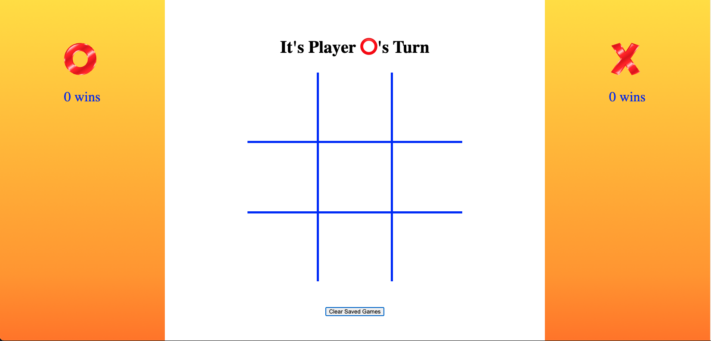
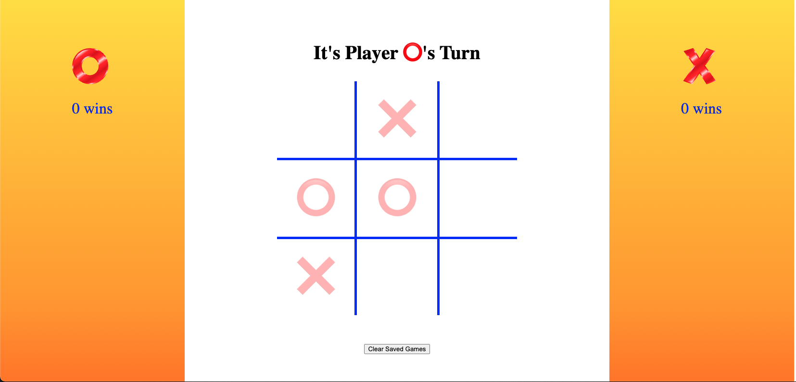

# Tic-Tac-Toe

Tic-Tac-Toe is a game that allows two players to play the classic game of tic-tac-toe. Players can begin playing as soon as the page loads and wins will be saved until either player presses the clear wins button.

## Contributors

- [Brian Peterson](https://github.com/bpeterson2579)

## Preview

## How to use the App

Clone down [Tic-tac-toe](https://github.com/bpeterson2579/tic-tac-toe) and cd into the folder.

In the terminal, type open index.html and the app should open in your browser

Player ⭕️ starts with the first move and players alternate turns, trying to get 3 of their respective symbol in a row.

When players want to reset the win totals, click the "Clear Saved Games" button.

## Technologies used

- HTML
- CSS
- Javascript

## Original Assignment

Tic-Tac-Toe [rubric](https://frontend.turing.edu/projects/module-1/tic-tac-toe-solo.html)

## Personal wins

I was able to get the logic for the game to work on my own. I was anticipating that this would be really difficult, but breaking down the game into tiny steps helped tremendously.

## Personal struggles

I could not make the javascript as DRY as I would like. I tried many different methods and I couldn't get them to work properly.
I had some difficulties with localStorage as well. I wasn't aware that localStorage doesn't keep functionality of methods upon page load, so I had to refactor a bunch of stuff to get that to work.
